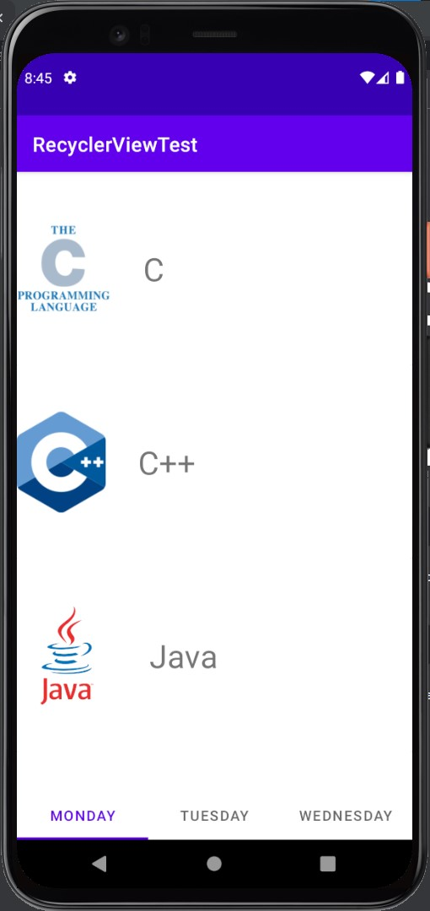
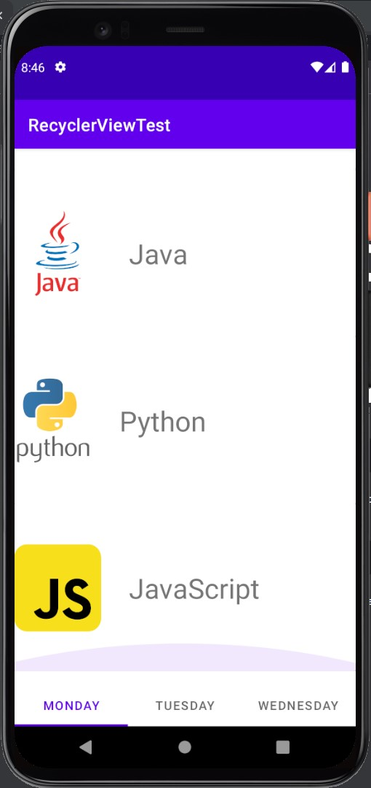
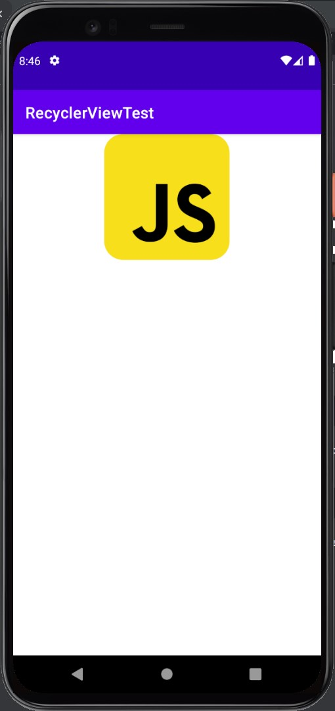

#   2nd exprement
##  blogs' address
***
-   `01st exprement  `https://github.com/Leningkoei/Project/tree/master/Android/test;
-   `02nd exprement  `here;

##  feeling
***
像我这种水平低的人不使用 C 语言这种基层语言就是因为能力不足没法每次都重新造轮子, 要站在巨人的肩膀上调用API;<br>
不过这学期学到了 Android Studio , 我对他的理解也就差不多是个特别诡异的框架? 差不多吧; 我以前也稍微学习使用过这些 JavaScript 的轻量小框架, Vue 之类的, 还有这学期开了个 ASP.NET 这诡异课; 这3个虽然使用难度不同, 感觉他们干的事都是大同小异的, 将基层功能的实现封装起来让开发人员使用; 不过 Vue 就是底层原理也不难理解? (现在学的很浅), 而且我平时使用也是 JavaScript 比较多, 感觉Vue使用起来稍微顺手1点; 但是我一点Java的基础也没得, 这学期刚开 Java 的课, 感觉站在 Android Studio 这个巨人的肩膀上, 向下看见的只有深不见底的深渊, 他实在是太深奥了, 以我的水平似乎很难使用他, 只能大摆特摆了;

##  dir
***
```
|-- ./
    |-- app/
        |-- src/
            |-- main/
                |-- java/com/recyclerviewtest/recycleviewtest/
                    |-- describeActivity.java   -- .java怎么小写开头了;
                    |-- MainActivity.java
                    |-- MyAdapter.java
                |-- res/
                    |-- drawable/...            -- icons;
                    |-- layout/
                        |-- activity_describe.xml
                        |-- activity_main.xml
                        |-- footer.xml
                        |-- my_row.xml

```
##  run result
***


<br>点击任意1个 row;<br>


##  code
***
```MainActivity.java```
```java []
package com.recyclerviewtest.recyclerviewtest;

import androidx.appcompat.app.AppCompatActivity;
import androidx.recyclerview.widget.LinearLayoutManager;
import androidx.recyclerview.widget.RecyclerView;
import android.os.Bundle;

public class MainActivity extends AppCompatActivity {

    RecyclerView recyclerView;
    String programmingLanguages[];
    int images[] = {
            R.drawable.c_icon,
            R.drawable.cpp_icon,
            R.drawable.java_icon,
            R.drawable.python_icon,
            R.drawable.javascript_icon
    };

    @Override
    protected void onCreate(Bundle savedInstanceState) {
        super.onCreate(savedInstanceState);
        setContentView(R.layout.activity_main);

        this.recyclerView = findViewById(R.id.recyclerView);
        this.programmingLanguages = getResources().getStringArray(R.array.programming_languages);

        MyAdapter myAdapter = new MyAdapter(this, programmingLanguages, images);
        recyclerView.setAdapter(myAdapter);
        recyclerView.setLayoutManager(new LinearLayoutManager(this));
    }
}

```
```activity.xml```
```xml []
<?xml version="1.0" encoding="utf-8"?>
<LinearLayout xmlns:android="http://schemas.android.com/apk/res/android"
    xmlns:app="http://schemas.android.com/apk/res-auto"
    xmlns:tools="http://schemas.android.com/tools"
    android:layout_width="match_parent"
    android:layout_height="match_parent"
    android:orientation="vertical"
    tools:context=".MainActivity"
    android:id="@+id/mainActivity">

    <androidx.recyclerview.widget.RecyclerView
        android:id="@+id/recyclerView"
        android:layout_width="match_parent"
        android:layout_height="600dp">

    </androidx.recyclerview.widget.RecyclerView>

    <include
        layout="@layout/footer"
        android:layout_width="match_parent"
        android:layout_height="0dp"
        android:layout_weight="3" >

    </include>

</LinearLayout>

```
```footer.xml```
```xml []
<!-- 姑且是尝试着写了个只有样式的TabView -->
<?xml version="1.0" encoding="utf-8"?>
<androidx.constraintlayout.widget.ConstraintLayout xmlns:android="http://schemas.android.com/apk/res/android"
    xmlns:app="http://schemas.android.com/apk/res-auto"
    android:layout_width="match_parent"
    android:layout_height="wrap_content">

    <com.google.android.material.tabs.TabLayout
        android:layout_width="match_parent"
        android:layout_height="wrap_content"
        app:layout_constraintBottom_toBottomOf="parent"
        app:layout_constraintEnd_toEndOf="parent"
        app:layout_constraintStart_toStartOf="parent">

        <com.google.android.material.tabs.TabItem
            android:layout_width="wrap_content"
            android:layout_height="wrap_content"
            android:text="Monday" />

        <com.google.android.material.tabs.TabItem
            android:layout_width="wrap_content"
            android:layout_height="wrap_content"
            android:text="Tuesday" />

        <com.google.android.material.tabs.TabItem
            android:layout_width="wrap_content"
            android:layout_height="wrap_content"
            android:text="Wednesday" />
    </com.google.android.material.tabs.TabLayout>
</androidx.constraintlayout.widget.ConstraintLayout>

```
```describeActivity.java```
```java []
package com.recyclerviewtest.recyclerviewtest;

import androidx.appcompat.app.AppCompatActivity;
import android.os.Bundle;
import android.util.Log;
import android.widget.ImageView;

public class describeActivity extends AppCompatActivity {

    ImageView mainImageView;
    int myImage;

    @Override
    protected void onCreate(Bundle savedInstanceState) {
        super.onCreate(savedInstanceState);
        setContentView(R.layout.activity_describe);

        mainImageView = findViewById(R.id.imageView);

        getData();
        setData();
    }
    private void getData() {
        if (getIntent().hasExtra("myImage")) {
            this.myImage = getIntent().getIntExtra("myImage", 1);
        }
    }
    private void setData() {
        mainImageView.setImageResource(this.myImage);
    }
}

```
```activity_describe.xml```
```xml []
<?xml version="1.0" encoding="utf-8"?>
<androidx.constraintlayout.widget.ConstraintLayout xmlns:android="http://schemas.android.com/apk/res/android"
    xmlns:app="http://schemas.android.com/apk/res-auto"
    xmlns:tools="http://schemas.android.com/tools"
    android:layout_width="match_parent"
    android:layout_height="match_parent"
    tools:context=".describeActivity">

    <ImageView
        android:id="@+id/imageView"
        android:layout_width="wrap_content"
        android:layout_height="wrap_content"
        android:adjustViewBounds="true"
        android:maxWidth="160dp"
        android:maxHeight="160dp"
        app:layout_constraintEnd_toEndOf="parent"
        app:layout_constraintStart_toStartOf="parent"
        app:layout_constraintTop_toTopOf="parent"
        app:srcCompat="@mipmap/ic_launcher" />
</androidx.constraintlayout.widget.ConstraintLayout>

```
```MyAdapter.java```
```java []
package com.recyclerviewtest.recyclerviewtest;

import android.content.Context;
import android.content.Intent;
import android.util.Log;
import android.view.LayoutInflater;
import android.view.View;
import android.view.ViewGroup;
import android.widget.ImageView;
import android.widget.TextView;
import androidx.annotation.NonNull;
import androidx.constraintlayout.widget.ConstraintLayout;
import androidx.recyclerview.widget.RecyclerView;

public class MyAdapter extends RecyclerView.Adapter<MyAdapter.MyViewHolder> {
    Context context;
    String str[];
    int images[];
    public MyAdapter(Context context, String[] str, int images[]) {
        this.context = context;
        this.str = str;
        this.images = images;
    }
    @NonNull
    @Override
    public MyViewHolder onCreateViewHolder(@NonNull ViewGroup parent, int viewType) {
        LayoutInflater inflater = LayoutInflater.from(context);
        View view = inflater.inflate(R.layout.my_row, parent, false);
        return new MyViewHolder(view);
    }

    @Override
    public void onBindViewHolder(@NonNull MyViewHolder holder, int position) {
        holder.str.setText(this.str[position]);
        holder.images.setImageResource(this.images[position]);
        int thisPosition = position;
        holder.myRow.setOnClickListener(new View.OnClickListener() {
            @Override
            public void onClick(View view) {
                Log.v("tag", Integer.toString(thisPosition));
                Intent intent = new Intent(context, describeActivity.class);
                intent.putExtra("myImage", images[thisPosition]);
                context.startActivity(intent);
            }
        });
    }

    @Override
    public int getItemCount() {
        return this.images.length;
    }

    public class MyViewHolder extends RecyclerView.ViewHolder {

        TextView str;
        ImageView images;
        ConstraintLayout myRow;
        ConstraintLayout mainActivity;

        public MyViewHolder(@NonNull View itemView) {
            super(itemView);
            str = itemView.findViewById(R.id.title);
            images = itemView.findViewById(R.id.icon);
            myRow = itemView.findViewById(R.id.myRow);
            mainActivity = itemView.findViewById(R.id.mainActivity);
        }
    }
}

```
```my_row.xml```
```xml []
<?xml version="1.0" encoding="utf-8"?>
<androidx.constraintlayout.widget.ConstraintLayout xmlns:android="http://schemas.android.com/apk/res/android"
    xmlns:app="http://schemas.android.com/apk/res-auto"
    xmlns:tools="http://schemas.android.com/tools"
    android:layout_width="match_parent"
    android:layout_height="wrap_content"
    android:id="@+id/myRow">

    <androidx.cardview.widget.CardView
        android:layout_width="match_parent"
        android:layout_height="wrap_content"
        app:layout_constraintBottom_toBottomOf="parent"
        app:layout_constraintEnd_toEndOf="parent"
        app:layout_constraintStart_toStartOf="parent"
        app:layout_constraintTop_toTopOf="parent">

        <androidx.constraintlayout.widget.ConstraintLayout
            android:layout_width="match_parent"
            android:layout_height="192dp">

            <ImageView
                android:id="@+id/icon"
                android:layout_width="wrap_content"
                android:layout_height="wrap_content"
                android:adjustViewBounds="true"
                android:maxWidth="100dp"
                android:maxHeight="100dp"
                app:layout_constraintBottom_toBottomOf="parent"
                app:layout_constraintStart_toStartOf="parent"
                app:layout_constraintTop_toTopOf="parent"
                app:srcCompat="@mipmap/ic_launcher" />

            <TextView
                android:id="@+id/title"
                android:layout_width="wrap_content"
                android:layout_height="wrap_content"
                android:layout_marginStart="32dp"
                android:layout_marginTop="16dp"
                android:layout_marginBottom="16dp"
                android:text="Title"
                android:textSize="32sp"
                app:layout_constraintBottom_toBottomOf="parent"
                app:layout_constraintStart_toEndOf="@+id/icon"
                app:layout_constraintTop_toTopOf="parent" />
        </androidx.constraintlayout.widget.ConstraintLayout>
    </androidx.cardview.widget.CardView>
</androidx.constraintlayout.widget.ConstraintLayout>

```
```string.xml```
```xml []
<resources>
    <string name="app_name">RecyclerViewTest</string>
    <string-array name="programming_languages">
        <item>C</item>
        <item>C++</item>
        <item>Java</item>
        <item>Python</item>
        <item>JavaScript</item>
    </string-array>
</resources>

```
