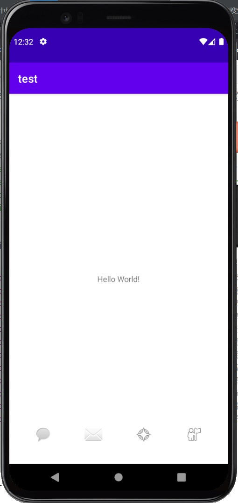
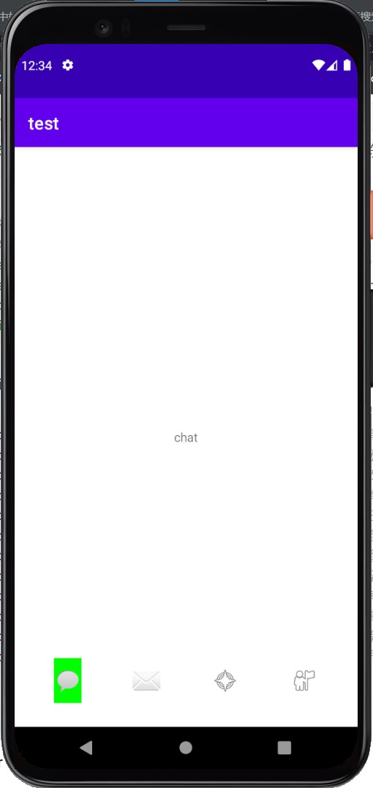
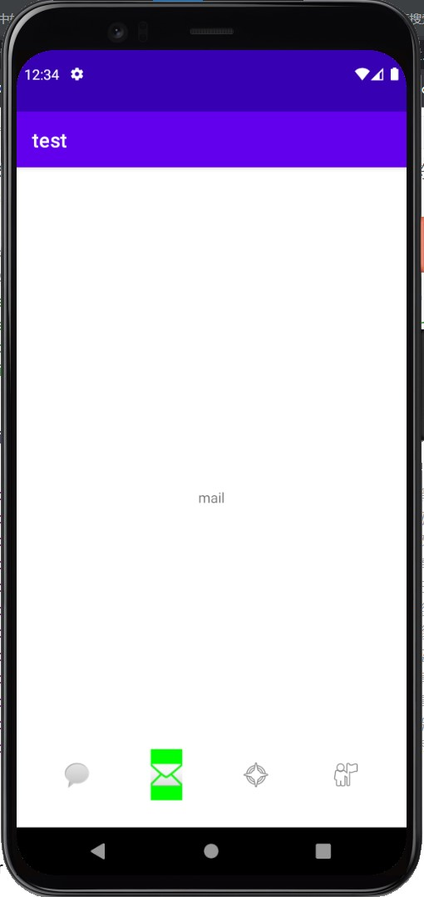
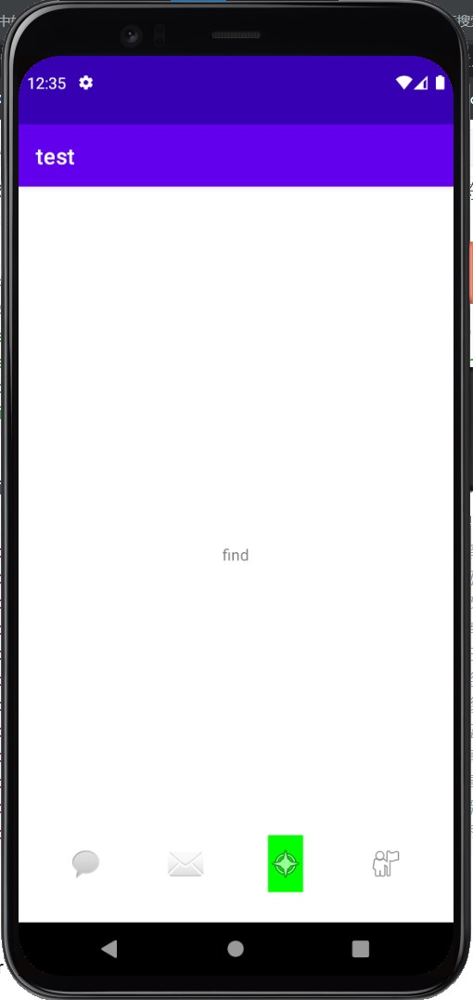
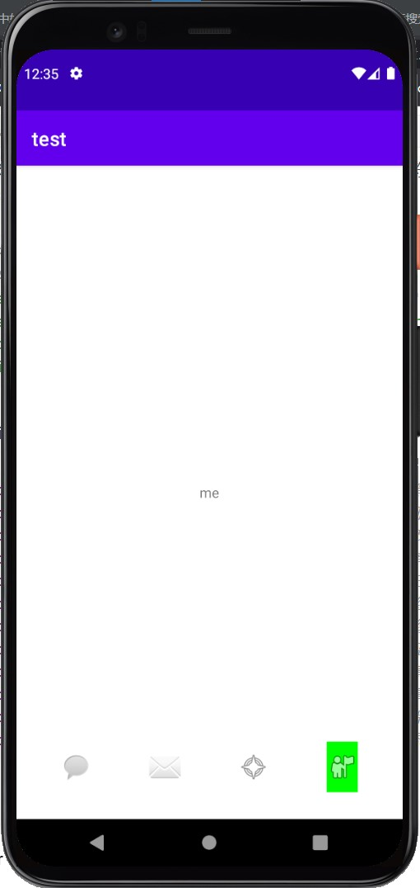

#   0th exprement
##  文件目录
```
|---./
    |---app/
        |---src/
            |---main/
                |---java/com/test/MainActivity.java
                |---res/layout/activity_main.xml
```

##  运行结果
;
;
;
;
;

##  code
```MainActivity.java```
``` java []
package com.test;

import androidx.appcompat.app.AppCompatActivity;

import android.graphics.Color;
import android.os.Bundle;
import android.view.View;
import android.widget.ImageButton;
import android.widget.TextView;

public class MainActivity extends AppCompatActivity {

    @Override
    protected void onCreate(Bundle savedInstanceState) {
        super.onCreate(savedInstanceState);
        setContentView(R.layout.activity_main);
        // 拿到文字;
        TextView msg = findViewById(R.id.textView);
        // 拿到4个按钮;
        ImageButton chatButton = findViewById(R.id.chatButton);
        ImageButton mailButton = findViewById(R.id.mailButton);
        ImageButton compassButton = findViewById(R.id.compassButton);
        ImageButton meButton = findViewById(R.id.meButton);
        // 活动图标背景颜色: 绿色, 睡眠图标背景颜色: 白色;
        int activityIconColor = Color.parseColor("green");
        int sleepIconColor = Color.parseColor("white");
        // 初始化图标背景颜色;
        chatButton.setBackgroundColor(sleepIconColor);
        mailButton.setBackgroundColor(sleepIconColor);
        compassButton.setBackgroundColor(sleepIconColor);
        meButton.setBackgroundColor(sleepIconColor);
        // chatButton点击事件;  -- 以后同一系列事件行为同此事件;
        chatButton.setOnClickListener(new View.OnClickListener() {
            @Override
            public void onClick(View view) {
                // 改变4个按钮的背景颜色;
                chatButton.setBackgroundColor(activityIconColor);
                mailButton.setBackgroundColor(sleepIconColor);
                compassButton.setBackgroundColor(sleepIconColor);
                meButton.setBackgroundColor(sleepIconColor);
                // 改变显示文字;
                msg.setText("chat");
            }
        });
        // mailButton点击事件;
        mailButton.setOnClickListener(new View.OnClickListener() {
            @Override
            public void onClick(View view) {
                chatButton.setBackgroundColor(sleepIconColor);
                mailButton.setBackgroundColor(activityIconColor);
                compassButton.setBackgroundColor(sleepIconColor);
                meButton.setBackgroundColor(sleepIconColor);
                msg.setText("mail");
            }
        });
        // compassButton点击事件;
        compassButton.setOnClickListener(new View.OnClickListener() {
            @Override
            public void onClick(View view) {
                chatButton.setBackgroundColor(sleepIconColor);
                mailButton.setBackgroundColor(sleepIconColor);
                compassButton.setBackgroundColor(activityIconColor);
                meButton.setBackgroundColor(sleepIconColor);
                msg.setText("find");
            }
        });
        // meButton点击事件;
        meButton.setOnClickListener(new View.OnClickListener() {
            @Override
            public void onClick(View view) {
                chatButton.setBackgroundColor(sleepIconColor);
                mailButton.setBackgroundColor(sleepIconColor);
                compassButton.setBackgroundColor(sleepIconColor);
                meButton.setBackgroundColor(activityIconColor);
                msg.setText("me");
            }
        });
    }
}

```
```activity_main.xml```
``` xml []
<?xml version="1.0" encoding="utf-8"?>
<androidx.constraintlayout.widget.ConstraintLayout xmlns:android="http://schemas.android.com/apk/res/android"
    xmlns:app="http://schemas.android.com/apk/res-auto"
    xmlns:tools="http://schemas.android.com/tools"
    android:layout_width="match_parent"
    android:layout_height="match_parent"
    tools:context=".MainActivity">

    <TextView
        android:id="@+id/textView"
        android:layout_width="wrap_content"
        android:layout_height="wrap_content"
        android:text="Hello World!"
        app:layout_constraintBottom_toBottomOf="parent"
        app:layout_constraintLeft_toLeftOf="parent"
        app:layout_constraintRight_toRightOf="parent"
        app:layout_constraintTop_toTopOf="parent" />

    <ImageButton
        android:id="@+id/chatButton"
        android:layout_width="wrap_content"
        android:layout_height="wrap_content"
        app:layout_constraintBottom_toBottomOf="parent"
        app:layout_constraintEnd_toEndOf="parent"
        app:layout_constraintHorizontal_bias="0.125"
        app:layout_constraintStart_toStartOf="parent"
        app:layout_constraintTop_toBottomOf="@+id/textView"
        app:layout_constraintVertical_bias="0.9"
        app:srcCompat="@android:drawable/sym_action_chat"
        tools:ignore="SpeakableTextPresentCheck" />

    <ImageButton
        android:id="@+id/mailButton"
        android:layout_width="wrap_content"
        android:layout_height="wrap_content"
        app:layout_constraintBottom_toBottomOf="parent"
        app:layout_constraintEnd_toEndOf="parent"
        app:layout_constraintHorizontal_bias="0.375"
        app:layout_constraintStart_toStartOf="parent"
        app:layout_constraintTop_toBottomOf="@+id/textView"
        app:layout_constraintVertical_bias="0.9"
        app:srcCompat="@android:drawable/ic_dialog_email"
        tools:ignore="SpeakableTextPresentCheck" />

    <ImageButton
        android:id="@+id/compassButton"
        android:layout_width="wrap_content"
        android:layout_height="wrap_content"
        app:layout_constraintBottom_toBottomOf="parent"
        app:layout_constraintEnd_toEndOf="parent"
        app:layout_constraintHorizontal_bias="0.625"
        app:layout_constraintStart_toStartOf="parent"
        app:layout_constraintTop_toBottomOf="@+id/textView"
        app:layout_constraintVertical_bias="0.9"
        app:srcCompat="@android:drawable/ic_menu_compass"
        tools:ignore="SpeakableTextPresentCheck" />

    <ImageButton
        android:id="@+id/meButton"
        android:layout_width="wrap_content"
        android:layout_height="wrap_content"
        app:layout_constraintBottom_toBottomOf="parent"
        app:layout_constraintEnd_toEndOf="parent"
        app:layout_constraintHorizontal_bias="0.875"
        app:layout_constraintStart_toStartOf="parent"
        app:layout_constraintTop_toBottomOf="@+id/textView"
        app:layout_constraintVertical_bias="0.9"
        app:srcCompat="@android:drawable/ic_menu_myplaces"
        tools:ignore="SpeakableTextPresentCheck" />

</androidx.constraintlayout.widget.ConstraintLayout>

```
