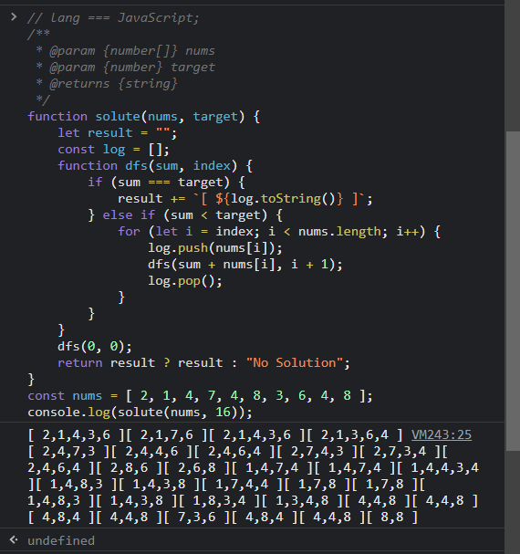
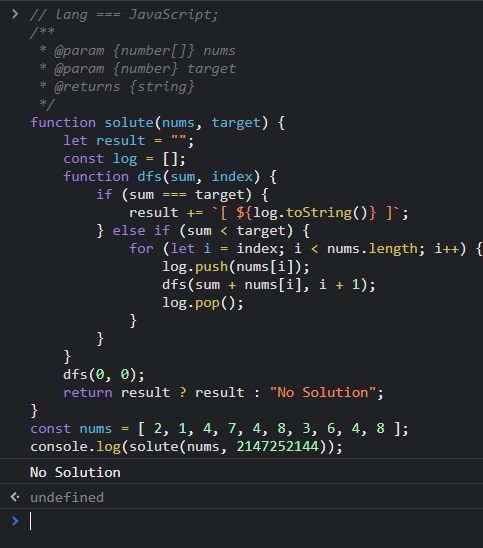
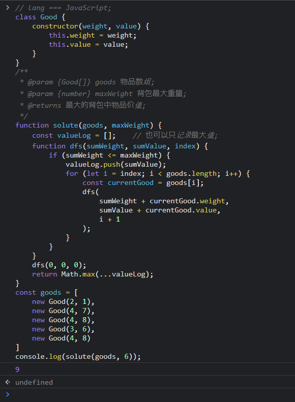

#   第2次作业
##  算法实现题5: 5 - 1
***
-   没有做txt的输入输出;
-   solute 的返回值是所有符合条件的数组的字符串;
-   若是只想拿到 1个 没有特殊要求 的结果提前结束, 可以在 `solute > dfs > else if 0 > for` 的条件中加上1条: `!result` ;
-   我这个集合可以有重复元素, 也可以没有;
```javascript []
// lang === JavaScript;
/**
 * @param {number[]} nums 集合;
 * @param {number} target 想要求得的子集和;
 * @returns {string}
 */
function solute(nums, target) {
    let result = "";
    const log = [];
    function dfs(sum, index) {
        if (sum === target) {
            result += `[ ${log.toString()} ]`;
        } else if (sum < target) {
            for (let i = index; i < nums.length; i++) {
                log.push(nums[i]);
                dfs(sum + nums[i], i + 1);
                log.pop();
            }
        }
    }
    dfs(0, 0);
    return result ? result : "No Solution";
}
const nums = [ 2, 1, 4, 7, 4, 8, 3, 6, 4, 8 ];
// 输出示例0;
console.log(solute(nums, 16));
// 输出示例1;
console.log(solute(nums, 2147483648));
```
-   输出示例0:<br>

```
[ 2,1,4,3,6 ][ 2,1,7,6 ][ 2,1,4,3,6 ][ 2,1,3,6,4 ][ 2,4,7,3 ][ 2,4,4,6 ][ 2,4,6,4 ][ 2,7,4,3 ][ 2,7,3,4 ][ 2,4,6,4 ][ 2,8,6 ][ 2,6,8 ][ 1,4,7,4 ][ 1,4,7,4 ][ 1,4,4,3,4 ][ 1,4,8,3 ][ 1,4,3,8 ][ 1,7,4,4 ][ 1,7,8 ][ 1,7,8 ][ 1,4,8,3 ][ 1,4,3,8 ][ 1,8,3,4 ][ 1,3,4,8 ][ 4,4,8 ][ 4,4,8 ][ 4,8,4 ][ 4,4,8 ][ 7,3,6 ][ 4,8,4 ][ 4,4,8 ][ 8,8 ]
```
-   输出示例1:<br>


##  01背包
***
### 问题
-   第 `i` 物品: { 重量: `w[i]`, 价值: `v[i]` };
-   背包容量 `weightMax`;
-   选取物品使得背包内总价值最大;

### 尝试求解
```javascript []
// lang === JavaScript;
class Good {
    constructor(weight, value) {
        this.weight = weight;
        this.value = value;
    }
}
/**
 * @param {Good[]} goods 物品数组;
 * @param {number} maxWeight 背包最大重量;
 * @returns 最大的背包中物品价值;
 */
function solute(goods, maxWeight) {
    const valueLog = [];    // 也可以只记录最大值;
    function dfs(sumWeight, sumValue, index) {
        if (sumWeight <= maxWeight) {
            valueLog.push(sumValue);
            for (let i = index; i < goods.length; i++) {
                const currentGood = goods[i];
                dfs(
                    sumWeight + currentGood.weight,
                    sumValue + currentGood.value,
                    i + 1
                );
            }
        }
    }
    dfs(0, 0, 0);
    return Math.max(...valueLog);
}
const goods = [
    new Good(2, 1),
    new Good(4, 7),
    new Good(4, 8),
    new Good(3, 6),
    new Good(4, 8)
]
// 输出示例0;
console.log(solute(goods, 6));
```
-   输出示例0:<br>

-   分支限界法好像是广度优先搜索的1种, 通过队列的数据结构, 出队队首, 将队首的所有子结点入队, 直到找到结果. 不过这个问题我无法判断这个队首的子结点是哪些个, 难道是所有不超过 maxWeight 的物品都是? 那这个队列的内存占用就有点大了, 而我没有想到其他的子结点的可能, 所以就没有写上;
